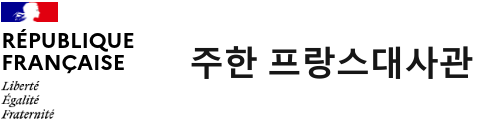

📅 Date: **Thursday 29 october 2026**, from 9am to 4pm

📍 Location: French Embassy, Seoul

✍️ Registration (mandatory and *before Oct 1st*): https://framaforms.org/french-korean-systems-biology-workshop-1st-edition-1781879123 

### Scope and objectives

The workshop aims at making connections between the French and Korean scientific communities in mathematical and computational methods for systems biology, with applications to cancer research.

The program consists both in scientific talks related to mathematical and computational models in systems biology, with a focus on logical models for cancer research, as well as in presentations of international funding schemes to promote French-Korean scientific cooperation in this domain.

### Program overview

The workshop will take place on Thursday 29 October 2026, from 9am to 4pm at the French Embassy in Seoul.

Confirmed speakers:
* 🇫🇷 **Laurence Calzone** (Institut Curie, Paris, Frace)\
  *Systems biology of cancer*
    
* 🇫🇷 **Loïc Paulevé** (CNRS/LaBRI, Bordeaux, France; coPI of ANR-NRF REPAIRNET project)\
 *Symbolic AI methods for systems biology*
    
* 🇫🇷 **Élisabeth Rémy** (CNRS/I2M, Marseille, France)\
  *Mathematical modeling for systems biology*
    
* 🇰🇷 **Dongkwan Shin** (National Cancer Center, South Korea; coPI of ANR-NRF REPAIRNET project)\
  *Dynamic modeling of cancer cells*
    
* 🇰🇷 **Kwang-Hyun Cho** (KAIST, South Korea)\
  *Engineering methods for systems biology of cancer*
    
* 🇪🇺 **Tomasz Wierzbowsk** ([EURAXESS Korea](http://korea.euraxess.org/))\
  *European funding schemes*

Final program to be published soon.

### Venue

⚠️ You will need to provide a formal identity document. **Registration is mandatory**.

**French embassy**
> 43-12 Seosomun-ro, Seodaemun-gu\
> Seoul\
> [Google Map](https://maps.app.goo.gl/C6d6wvSjKk4yjBpFA)\
> [Kakao Map](https://place.map.kakao.com/8509394)

### Organizing commitee

* [Dongkwan Shin](https://ncc-gcsp.ac.kr/n_academics/shindongkwan.jsp?flag=22) (NCC, Goyang, South Korea)
* [Loïc Paulevé](https://loicpauleve.name) (CNRS/LaBRI, Bordeaux, France)
* [Kwang-Hyun Cho](https://sbie.kaist.ac.kr/) (KAIST, Daejeon, South Korea)
* [Elisabeth Rémy](https://remy.perso.math.cnrs.fr/) (CNRS/I2M, Marseille, France)
* [Sébastien Codina](https://www.linkedin.com/in/sebastiencodina/?locale=fr) (French Embassy, Seoul, South Korea)

### Acknowledgment

&nbsp; &nbsp;&nbsp; &nbsp;&nbsp; &nbsp;

